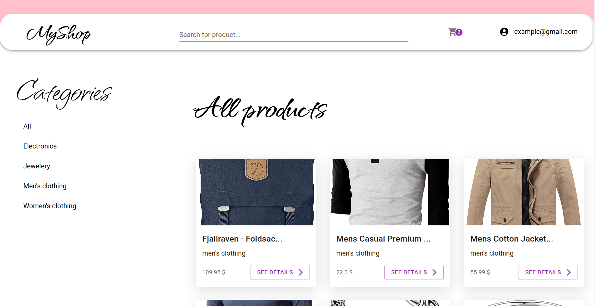

# Fake e-commerse site

## About the project

Link: https://e-commerse-auth-development.web.app/

Just a little hobby project, using React with Typescript and Firebase.

Users in this application are able to:

- search for products by category or name
- see product details and related products
- create an account and log in
- add / delete products from cart
- see personal information and can change it
- see details of the order

## Thing to add/improve

- site is not fully responsive yet
- add ability to remove account
- possibility to add a profile picture

## Sample accounts to log in:

1:
- login: example@gmail.com
- password: 123456

2:
- login: hitatilut@gotgel.org
- password: 123456
